# What's about
When we create a new **blueprint** for deploying a VM, it will get a name something like *Cloud_Machine_1-mcmxxx-xxxxxxxxxxxx'*, but most of cases we would not like this name, unless we prefer this name with **Infrastructure as Code** to avoid name clash. Let's take a look what we can do with the computer names.

# Resources name 

The first option is we use Machine objects on the design canvas in vRA Cloud Assembly, all we need to do is rename resources name to the prefix we want.

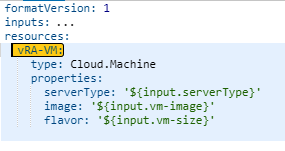
After the deployment, vm name in vCenter is:

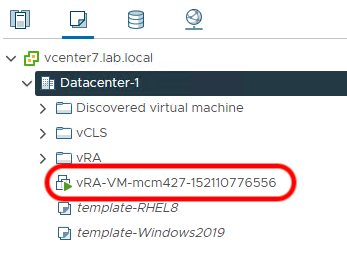

Another option is to add the *name* property to the resources in the YAML file, for insance the prefix you would like is **myVM**, the vm will now be named **myVM-mcmxxx-xxxxxxxxxxxx**as shown bellow:

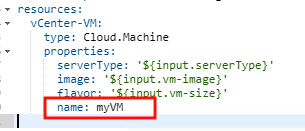

After the deployment, vm name in vCenter is:

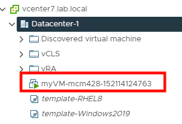

# Projects Provisioning Template
***Custom Naming Template** will substitue the auto-genearted machine names, we need make sure that the virtualmachine name is unique, otherwise the deployment may fail if a machine with the same name already exists.Number generator: add digits to generated names to make them unique. ${####} adds 4 digits.
This proposal is each *Project* will have one unique ID as prefix, this unique prifex will be used as part of the virtualmachine/computername/hostname. For instance the unique ID for human resource project can be `hr`, finance project can be `fin`, or it can line up with department ID, like `its` stands for IT service. As we would like to keep the hostname within 15 charaters, so best keep this part 3 characters? We can use custom properties assigned to the resource (from cloud template, project, etc.). I would suggest with ${resource.serverType}, so an *enum* added in the *inputs* to the blueprint will be ideal, something likt this
```enum:
      - App
      - Web
      - DB
```
Let's see put the template like this `${resource.prefix}-${resource.serverType}-${####}`

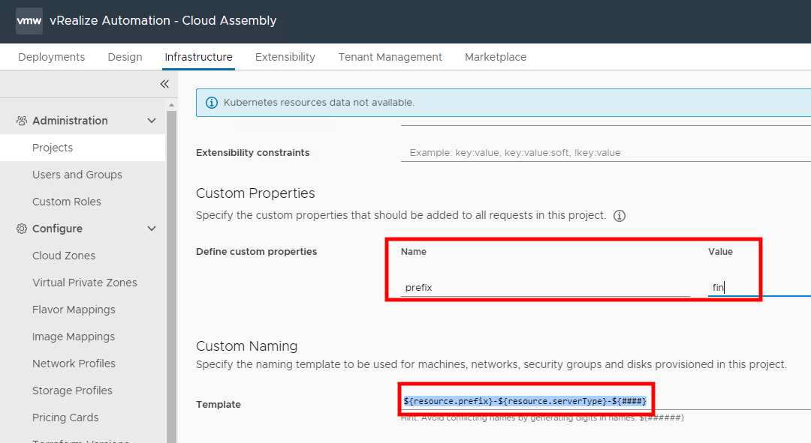

blueprint looks like this
```
formatVersion: 1
inputs:
  computerName:
    type: string
    maxLength: 15
    description: ComputerName / Hostname
    title: Computer Name
  vm-size:
    type: string
    enum:
      - Small
      - Medium
    description: Size of the virtualmachine
    title: VirtualMachine Size
  vm-image:
    type: string
    enum:
      - Windows2019
      - template-RHEL8
    description: Select OS image
  serverType:
    type: string
    enum:
      - App
      - Web
      - DB
    description: Select OS image
resources:
  Cloud_Machine_1:
    type: Cloud.Machine
    properties:
      serverType: '${input.serverType}'
      image: '${input.vm-image}'
      flavor: '${input.vm-size}'
      computerName: '${input.computerName}'
```
VM deployed to vcneter 

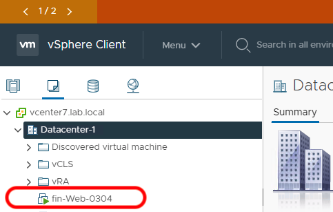

**fin-Web-0304** I can see this is a finance web server.


# Static hostname
Dynamic hostname/computerName is perfectly fine when we do some kind of DevOps, and frequently deploy and terminate VMs, but some cases we would like a STATIC hostname, we need give the server a hostname, then deploy the virtual machine.
We can use **ABX**(Action Based Extensibility) to achive this.
    **NOTE:**  You can refe about all the events from vmware [here](https://docs.vmware.com/en/vRealize-Automation/8.2/Using-and-Managing-Cloud-Assembly/GUID-B1561CF6-30EC-4D7D-B214-6AC8190289C5.html)
* In vRA **Cloud Assembly** select the **Extensibility** tab, under **Library** click on **Actions**. Click **New Action**.

``` python
def handler(context, inputs):
    old_name = inputs["resourceNames"][0]
    new_name = inputs["customProperties"]["computerName"]
    outputs = {}
    outputs["resourceNames"] = inputs["resourceNames"]
    outputs["resourceNames"][0] = new_name
    print("Setting machine name from {0} to {1}".format(old_name, new_name))
    return outputs
```
`new_name = inputs["customProperties"]["computerName"]` we will use **computerName** 'customProperties' as the computer name, so **computerName** will be the virtualmachine in vCenter as well. See the Blueprint below:
```
formatVersion: 1
inputs:
  computerName:
    type: string
    maxLength: 15
    description: ComputerName / Hostname
    title: Computer Name
  vm-size:
    type: string
    enum:
      - Small
      - Medium
    description: Size of the virtualmachine
    title: VirtualMachine Size
  vm-image:
    type: string
    enum:
      - Windows2019
      - RHEL8
    description: Select OS image
  serverType:
    type: string
    enum:
      - App
      - Web
      - DB
    description: Select OS image
resources:
  Cloud_Machine_1:
    type: Cloud.Machine
    properties:
      serverType: '${input.serverType}'
      image: '${input.vm-image}'
      flavor: '${input.vm-size}'
      computerName: '${input.computerName}'
```

* Next we need *subscripe*  **Computer Allocation** event, so the *Action* will be triggered to get the computer name right for us.
**Extensibility** | **Click Subscriptions** | **New Subscription**

* Enter a Name and select **Compute Allocation** as Event Topic.
**Action/workflow** select the *Action* we created , on this case is *RenameVM*
* swich on *condition* and set `event.data.blueprintId == '86c2fe64-4c39-4aa4-ad92-076d4b96dd9a'` '86c2fe64-4c39-4aa4-ad92-076d4b96dd9a' is the Blueprint ID, so this subscription only works with the Blueprint ID we specified.

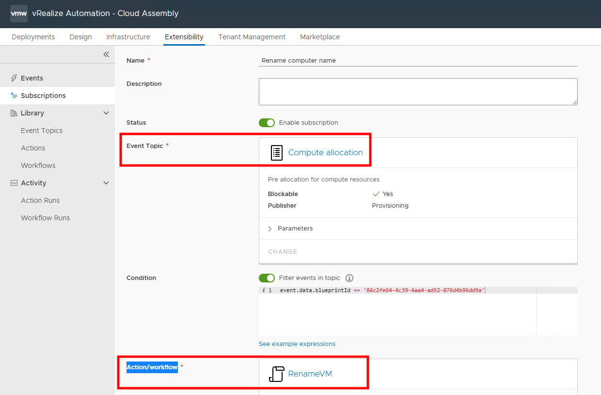

Let's build deploy the VM with the Blueprint

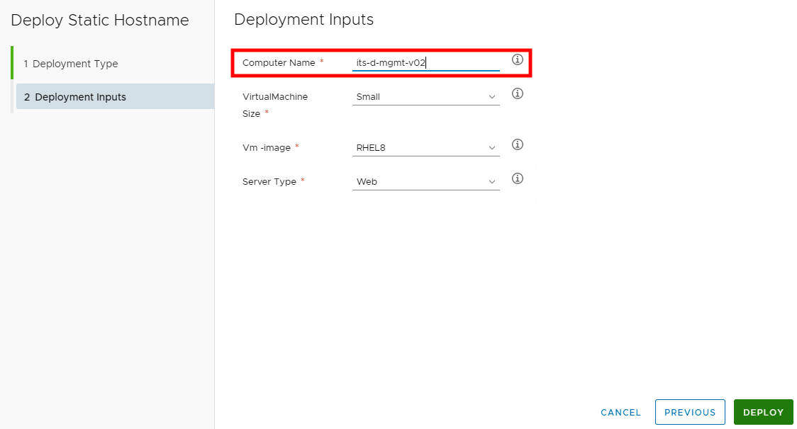

In vCenter

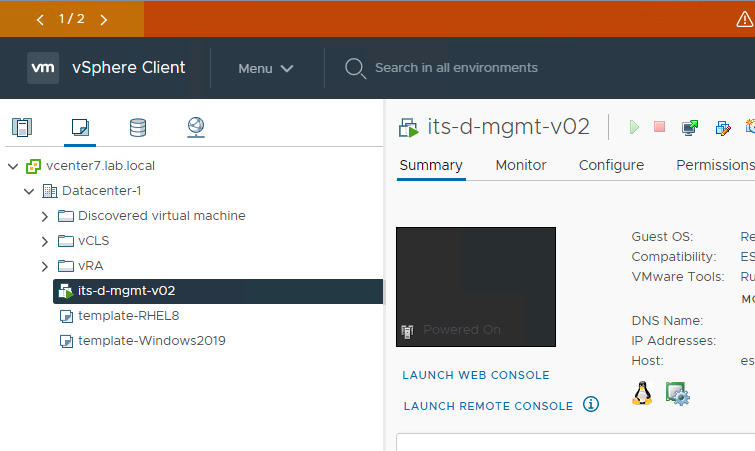
# CloudInit to set hostname

1. Unix
2. Windows

## windows

How to install Cloudbase-Init is [here](https://blogs.vmware.com/management/2019/11/cloudbase-init-windows-initialization.html)
* download here:  https://cloudbase.it/downloads/CloudbaseInitSetup_Stable_x64.msi

* Install `msiexec /i CloudbaseInitSetup.msi /qn /l*v log.txt`
* Document   [here](https://cloudbase-init.readthedocs.io/en/latest/index.html)

*cloudbase-init.conf*

```
[DEFAULT]  
username=Administrator  
groups=Administrators  
inject_user_password=false  
first_logon_behaviour=no  
config_drive_raw_hhd=false  
config_drive_cdrom=false  
config_drive_vfat=false  
bsdtar_path=C:\Program Files\Cloudbase Solutions\Cloudbase-Init\bin\bsdtar.exe  
mtools_path=C:\Program Files\Cloudbase Solutions\Cloudbase-Init\bin\  
verbose=true  
debug=true  
logdir=C:\Program Files\Cloudbase Solutions\Cloudbase-Init\log\  
logfile=cloudbase-init.log  
default_log_levels=comtypes=INFO,suds=INFO,iso8601=WARN,requests=WARN  
logging_serial_port_settings=  
mtu_use_dhcp_config=true  
ntp_use_dhcp_config=true  
local_scripts_path=C:\Program Files\Cloudbase Solutions\Cloudbase-Init\LocalScripts\  
metadata_services=cloudbaseinit.metadata.services.vmwareguestinfoservice.VMwareGuestInfoService,cloudbaseinit.metadata.services.ovfservice.OvfService 
plugins=cloudbaseinit.plugins.common.userdata.UserDataPlugin,cloudbaseinit.plugins.common.sethostname.SetHostNamePlugin
allow_reboot=true
```

blueprint
```
formatVersion: 1
inputs:
  computerName:
    type: string
    maxLength: 15
    description: ComputerName / Hostname
    title: Computer Name
  vm-size:
    type: string
    enum:
      - Small
      - Medium
    description: Size of the virtualmachine
    title: VirtualMachine Size
  vm-image:
    type: string
    enum:
      - Windows2019
      - RHEL8
      - win19
    description: Select OS image
  serverType:
    type: string
    enum:
      - App
      - Web
      - DB
    description: Select OS image
resources:
  virtualmachine:
    type: Cloud.Machine
    properties:
      serverType: '${input.serverType}'
      image: '${input.vm-image}'
      flavor: '${input.vm-size}'
      computerName: '${input.computerName}'
      cloudConfig: |
        #cloud-config          
        set_hostname: '${input.computerName}'
```
Let test a deployment with the blueprint:

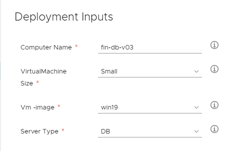

Deployment was successful, and here is what virtualmachine name in vCenter
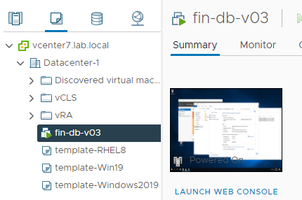

Login to windows, *Computer name* changed as below:

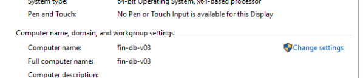
